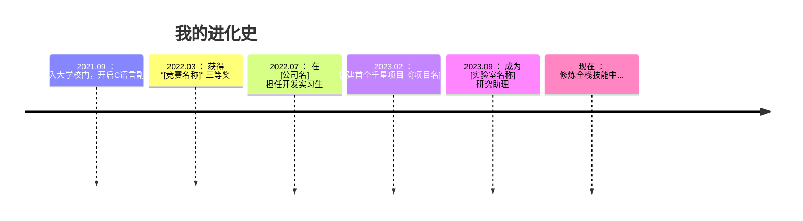

# 你好，我是 ZQ Jacky —— 一个 "Hello World" 写了 100 次还在写的学生
> ✨ **目标：** 用代码把作业变成艺术品（偶尔也把艺术变成 bug）  


---

## 🌱 当前状态 —— 一名萌新的进化史  
```python
while True:
    写代码()
    遇bug = True
    if 遇bug:
        查文档() + 喝奶茶()
    else:
        惊喜("居然能跑？！")
```


